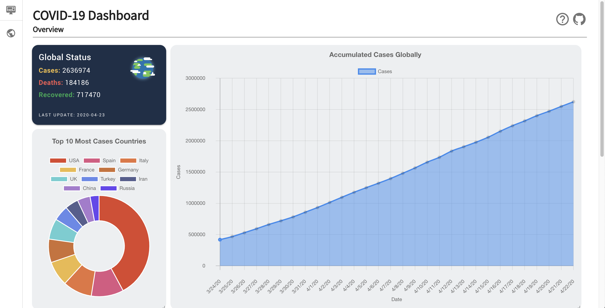

# COVID-19 Dashboard
A minimalist COVID-19 dashboard helps you get all information at a glance. <br>
Link: https://thomas-leung.github.io/covid19-dashboard/
|||
| :---: | :---: |
| Desktop View | Mobile View|

## Frontend technologies
- Vue.js
- vue-chartjs
- vue-grid-layout
- Vuetify

## API Endpoint
API Data is from [NovelCOVID API](https://github.com/NovelCOVID/API) which is based on World Meter and Johns Hopkins University's Data.
## Project setup
```
npm install
```

#### Compiles and hot-reloads for development
```
npm run serve
```